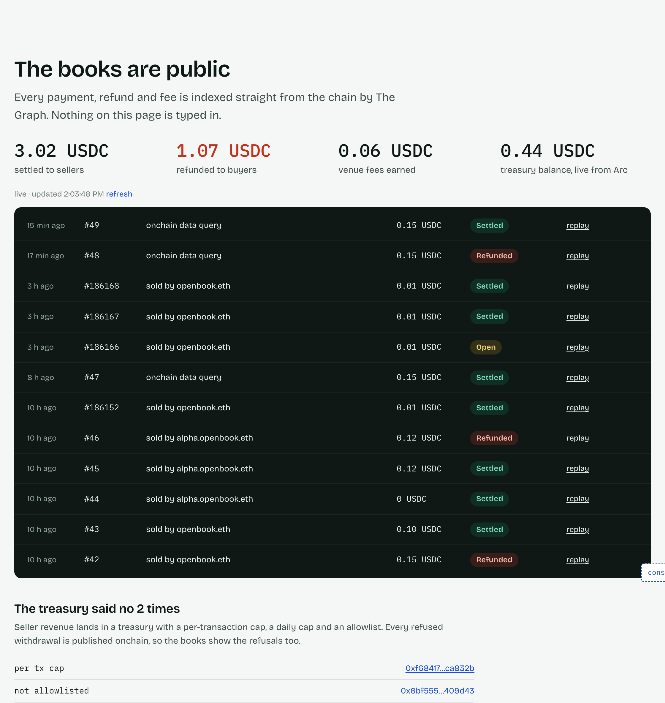
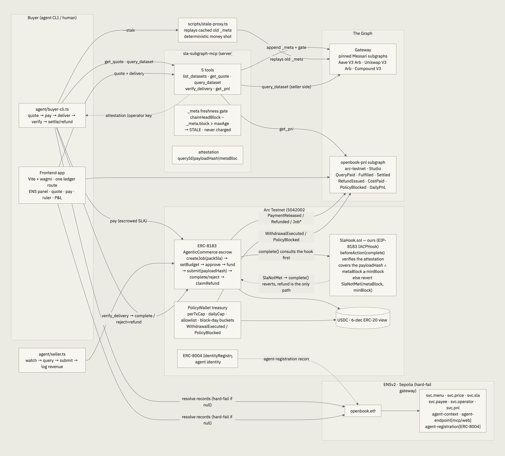
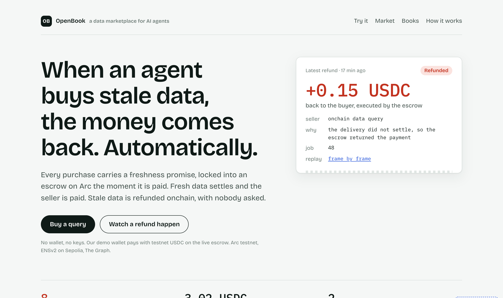

# OpenBook: The Data Marketplace for Agents

[](https://github.com/Aliserag/OpenBook/actions/workflows/ci.yml)

> The data marketplace for agents, with automatic refunds for every stale delivery.
> An autonomous agent that sells freshness-guaranteed onchain data queries, pays its own
> costs, and publishes its P&L onchain. Built for ETHOnline 2026 (Sep 4–16).

**Bounties targeted (one project, three sponsors):**
- **Arc: Best Agentic Economy Application with Circle Agent Stack** ($3,500; +$2,500 for a mainnet deployment by Sep 30)
- **The Graph: Best AI Tooling or AI Use Case with The Graph (Start Fresh)** ($5,000 pool)
- **ENS: Best Use of ENSv2** ($4,500)

## The pitch

**The data marketplace for agents, with automatic refunds for every stale delivery.**
Payment is the last mile of agent autonomy. Agents can hold keys and sign transactions, but
counterparties can't trust them: no service guarantees, no refunds, no recourse when the data
is stale. Everyone is building payment rails; nobody is building the control layer — a marketplace
fixes that: **anyone can list** (a seller is an ENS subname with four text records), **agents
compare**, **the escrow enforces** the SLA committed at payment time, and **the venue takes
2%** — of everyone's settlements.

**Why now:** 54% of organizations are already deploying AI agents
([KPMG U.S. AI Pulse, Q1 2026](https://kpmg.com/us/en/media/blogs/2026/q1-ai-pulse-3.html)) and
agentic commerce is projected at [$1.5T globally by 2030](https://www.juniperresearch.com/press/agentic-commerce-set-to-generate-15-trillion-globally-by-2030-as-payments-infrastructure-leaders-revealed/),
yet [27% of consumers trust no organization to run an AI shopping agent and 24% will never
delegate a purchase to one](https://www.checkout.com/newsroom/consumer-demand-for-ai-shopping-is-forming-fast-but-trust-for-agentic-commerce-is-still-catching-up).
The constraint is recourse, not capability. **Buyers** (any agent, and the operator funding
it) get recourse they can verify without trusting the seller; **sellers** of paid data get a
freshness guarantee they can charge for.

OpenBook's mechanic: **SLA-bound payments.** Every query carries verifiable conditions
committed at payment time (freshness block height, deliverable hash, deadline) through
Arc's ERC-8183 escrow standard. Settlement checks them deterministically. **Miss the SLA and
the refund executes onchain, automatically.** Money flows both ways.

**Watch the money move backwards (one click, no wallet):** a delivery pinned to a stale
`_meta` block got `REJECT (STALE_DATA)` and the escrow refunded the buyer on its own, 
[Refunded tx 0x25e7805a…6063f on ArcScan](https://testnet.arcscan.app/tx/0x25e7805ae79fd8320ccbc74d90dead9d87b082fd299ecfe5a5949a968e16063f),
indexed in the agent's books ([the live books](https://openbook.litai.ca/#books), 
no keys needed; [raw subgraph](https://api.studio.thegraph.com/query/1760032/open-book/v0.0.6)).
On the marketplace escrow the same mechanic refunded two stale deliveries in full:
[job 42 (0.15)](https://testnet.arcscan.app/tx/0xcef2e16b6028c650d6a33f9e3838d57f3d99e62963d6c6e3194e71ed19c40ca1)
and [job 46 (0.12)](https://testnet.arcscan.app/tx/0x85ef3525ea9e57818a6c99f8e858ed36a2994be1d30b8ce02b3d78a76964b9aa) —
refund == funded amount for both. The hook gates every settlement: `complete()` on
an unattested job reverts `MissingAttestation` (a call, so it leaves no transaction;
reproduce it with `cast call` on job 38 before its attestation), and the settle that
followed the attestation landed at
[0xd93aa95e…3ec4b6](https://testnet.arcscan.app/tx/0xd93aa95ee6552568653a8acfda21998a3173a87f537ebca79cf2d35ffd3ec4b6).



## FAQ — what exactly is being sold, and to whom

**Onchain data only, or any data?** The reference deployment sells
**subgraph-queried, onchain-indexed data** — any of The Graph's 15,000+
subgraphs becomes a sellable dataset with one config entry (`mcp/config/`).
The mechanism itself generalizes to **any feed that can be timestamped and
hashed** — prices, sports odds, weather, news: the SLA binds whatever the
seller can attest. Selling offchain research would need a trustworthy
freshness attestation for that source, which is the buyer's call to accept —
the shipped configs only claim what they can attest onchain.

**How is this different from an oracle?** Oracles *push* a feed into a
contract; you pay to publish. OpenBook is *pull*: a buyer pays per query and
the seller owes a spec — freshness floor, deliverable hash, deadline — enforced
by an escrow that refunds when the spec is missed. The product is not "better
data access"; it is **recourse** for machine-to-machine purchases.

**Why would anyone pay when they can query raw?** Raw queries give you data;
they don't give you (1) a counterparty who owes you a verifiable promise,
(2) a refund that executes without a support ticket, or (3) a payee whose books
are public. The target buyer is autonomous software and the teams running it —
trading/execution agents, risk monitors, settlement bots — where one stale
answer costs more than the query, and where nobody can open a dispute at 3am.

## Architecture



Rendered from the mermaid source in [docs/architecture.md](docs/architecture.md) (that file
carries the full flow, the deterministic demo path, and the trust model). The three sponsors
are organs, not stickers:

- **Arc (rail + cash register):** ERC-8004 agent identity, USDC nanopayments, ERC-8183
  escrow settlement, custom policy-gated treasury (`PolicyWallet.sol` with onchain
  `PolicyBlocked` events. Circle's built-in policies are mainnet-only; ours is the
  testnet-demoable path), and **onchain SLA adjudication** (`SlaHook.sol`, an
  EIP-8183 hook that blocks `complete()` unless the freshness proof covers the
  submitted deliverable and clears the floor; proven live: a stale completion
  reverts `SlaNotMet`, the refund path stays open). Wired through the shipped
  CLI: `--hook <addr>` + `OPENBOOK_ESCROW`/`OPENBOOK_HOOK`, a hooked job's
  settlement is enforced onchain, end to end, with the stock binary.
  **Sustainable by construction:** a configurable platform fee (2% on our
  escrow instance) routes every settlement's cut to the policy-gated treasury —
  verified onchain: the settlement receipt splits 0.0020 USDC to the
  PolicyWallet and 0.0980 to the seller (tx `0xb4fbc894…`).
- **The Graph (the product):** `sla-subgraph-mcp`, a generic MCP server with a
  packaged, node-runnable bin (npm publishing is the one-line post-freeze step)
  that turns any subgraph into a paid, freshness-gated product; OpenBook is the reference
  deployment. **The difference from a read-only MCP wrapper is where the freshness gate
  sits: it decides whether money moves.** Stale data is never charged, and a missed SLA
  refunds the buyer onchain, provenance that *costs* the seller, not a footnote on an
  answer. Plus the `open-book` Studio subgraph on **arc-testnet** indexing every
  payment/refund/policy event, the agent's audited books.
- **ENS (storefront + business license):** `openbook.eth` on ENSv2 Sepolia publishes menu,
  pricing, SLA, and payee as text records; buyers hard-fail without resolution
  ("No ENS, no payment"). The `svc.payee` record names the PolicyWallet as the
  only payee, the storefront can never route money anywhere but the
  policy-gated treasury. The agent also runs its **own ENSv2 subname registry**
  (UserRegistry via the VerifiableFactory): a dataset can be its own subname,
  `aave-v3-arbitrum-lending.openbook.eth` prices itself at 0.15 while the parent
  quotes 0.10, and the quote reads the most specific records through the
  hierarchical registry. `alpha.openbook.eth` has no resolver of its own and
  resolves through the parent's (wildcard resolution).

## The app

Open [https://openbook.litai.ca](https://openbook.litai.ca) and you are standing in the
marketplace. One page, five sections, every figure read live from ENS, the `open-book`
subgraph and the Arc escrow:

1. **The refund.** The latest real refund the escrow executed, as a receipt with its
   ArcScan link, and three live counters (refunds executed, USDC settled, sellers listed).
2. **Try it, keyless.** Pick a dataset, see the ENS price and the freshness promise in
   plain words, click **Buy**. Our demo wallet pays on the live escrow and a stepper shows
   every transaction as it lands: paid into escrow, data delivered with its block,
   freshness checked onchain, settled, 98/2 fee split. **Make it fail** runs the same
   purchase with the floor one block above the delivery: the hook refuses (`SlaNotMet`)
   and the escrow refunds, in the same click.
3. **The market.** Both sellers as cards, priced by their own ENS records, with the
   venue fee read from the escrow. Labeled honestly: two reference sellers we operate.
4. **The books.** Settled, refunded, venue fees and the treasury balance; a settlement
   board of the latest jobs (a judge's own runs appear immediately and confirm once the
   subgraph indexes them); the treasury's onchain refusals.
5. **How it works.** Arc, The Graph and ENS in plain words, the MCP quickstart, and the
   console for power users.



**Reliability.** Subgraph Studio rate-limits the public query endpoint per caller, so
both hosting lanes serve a same-origin cached proxy at `/api/subgraph`
(`app/public/_worker.js` on Cloudflare Pages, `app/public/api/subgraph.js` on Vercel):
fresh answers are cached 20 seconds and the last good copy is served, labeled, if Studio
answers 429. The page makes one subgraph poll per 20 seconds for all its sections.

**Two lanes, one bundle.** [https://openbook.litai.ca](https://openbook.litai.ca) is the
canonical URL (Cloudflare Pages, and the ENS `agent-endpoint[web]` record);
[https://ethonline2026-openbook.vercel.app](https://ethonline2026-openbook.vercel.app) is
the backup alias. `scripts/deploy-app.sh` publishes both from the same `dist/` and
verifies the bundles and the proxy before it reports PASS. `scripts/app-audit.mjs` is the
release gate: 20 browser assertions over the live page (hero, try it, market, books,
console, overflow at three widths, font floor, console errors).

**The console (`⌘K`)** is still there for judges who want the raw surfaces: 18 commands in
three families, **inspect** (read every live surface), **act** (transact as the demo
buyer), **sandbox** (safe re-enactments on the same live contracts).

| family | command | what it does |
| --- | --- | --- |
| inspect | `help` | list every command (`help <cmd>` for one line) |
| inspect | `status` | one-shot health: arc head, subgraph lag, ENS storefront, gateway key, demo wallet |
| inspect | `ens show` | live `svc.*` storefront records of `openbook.eth` |
| inspect | `datasets` | the storefront menu: 5 datasets with live ENS prices + SLA windows |
| inspect | `quote` | ENS-priced quote + SLA floor (live reads, no tx) |
| inspect | `books` | scoped P&L: totals + rows over our addresses (subgraph) |
| inspect | `jobs` | scoped job table from the subgraph |
| inspect | `job` | one job's detail: paid → fulfilled → settled/refunded |
| inspect | `lag` | arc head vs subgraph indexed block (freshness ruler) |
| inspect | `policy show` | PolicyWallet caps/spend + allowlist, read live from the contract |
| inspect | `replay` | the six-frame theater for a job (quote/pay/deliver/verdict/money/books) |
| act | `buy` | fund an ERC-8183 job at the live ENS price (demo key or connected wallet) |
| act | `deliver` | capture the gateway payload hash + freshness block and submit it onchain |
| act | `settle` | attest the delivery, verify + settle onchain, print verdict + fee split |
| sandbox | `policy refusals` | real `PolicyBlocked` rows from the subgraph (`PER_TX_CAP` / `DAILY_CAP` / `NOT_ALLOWLISTED`) |
| sandbox | `policy try-overspend` | simulated cap check: mirror of `checkWithdrawal` over live contract caps, no tx sent |
| sandbox | `sandbox stale` | floor pinned one block above the delivery so `complete()` reverts `SlaNotMet`; arm the refund |
| sandbox | `sandbox claim` | execute `claimRefund` for real after the deadline (live countdown) |

**Demo-buyer policy.** The Buy and Make it fail buttons, and the act and sandbox
commands, sign with the demo buyer key (`VITE_DEMO_BUYER_KEY` in `app/.env.local`):
testnet USDC as play money, spent live against the real escrow. When the balance runs
out, refill the demo buyer address at [faucet.circle.com](https://faucet.circle.com)
(Arc Testnet). The SLA hook's attester is a separate key that never reaches the browser:
the page asks `/api/attest`, which verifies the job, its floor and the submitted
deliverable onchain before it posts the proof. The demo key is only ever the buyer.

**The marketplace.** Two reference sellers are live, both registered through the ENSv2
storefront and priced by their own text records: `openbook.eth` (0.10 USDC/query, and
0.15 for the `aave-v3-arbitrum-lending` subname) and `alpha.openbook.eth`
([`sellers/alpha.json`](sellers/alpha.json), 0.12 USDC/query, payout to
`0xe09C8F90931E97d0aEE998885b306DDF08CE08Cc`). Both sell through the shared market escrow
`0x967e005154D0F62C33Eac8E2F44b44d4C4C07Dd5`, whose 2 percent venue fee (`platformFeeBP`)
routes every settlement's cut to the policy-gated treasury. A chosen-seller settlement is
onchain: job 45 was picked by price (`--prefer cheap`), and the receipt split
[0.1176 USDC to alpha and 0.0024 USDC to the PolicyWallet (tx 0xd122ade9…6466f0d)](https://testnet.arcscan.app/tx/0xd122ade9f2b057ea55a9d9e5163f57cf9e440f0bf8ac35401737832fa6646f0d).

**The ENS-edit story.** The storefront is text records, so running the marketplace is
editing records: repricing `alpha.openbook.eth` is one `ens set text`, and the app and the
buyer CLI pick it up on the next read, no redeploy. Quotes prefer the most specific
records through the hierarchical subname registry, and a storefront without
`svc.price`/`svc.sla`/`svc.payee` hard-fails ("No ENS, no payment") rather than
defaulting to anything.

## Repo layout

- `contracts/`: PolicyWallet.sol (policy treasury) + SlaHook.sol (onchain SLA adjudication) + tests
- `agent/`: agent loop, ERC-8183 settlement spine, buyer CLI
- `mcp/`: `sla-subgraph-mcp` (the Graph tooling entry) + `SKILL.md`
- `subgraph/`: the P&L subgraph source (deployed to Studio as `open-book`, Arc testnet)
- `app/`: the product page (Vite + React): hero refund, keyless live purchase, market, books, console
- `scripts/`: ENS setup, spikes, stale-replay proxy
- `docs/`: architecture, design decisions, demo script, submission copy

## Quickstart

**Judge the live agent keyless in ~60 seconds** (quote + P&L need no keys, since the ENS
records and the Studio endpoint are public):

```bash
git clone https://github.com/Aliserag/OpenBook && cd OpenBook
bun install

# talk to the seller agent over stdio MCP: list the menu, read the live quote,
# read the agent's onchain books:
printf '%s\n' \
  '{"jsonrpc":"2.0","id":1,"method":"initialize","params":{"protocolVersion":"2024-11-05","capabilities":{},"clientInfo":{"name":"cli","version":"1.0"}}}' \
  '{"jsonrpc":"2.0","id":2,"method":"tools/call","params":{"name":"get_quote","arguments":{"datasetId":"aave-v3-arbitrum-lending"}}}' \
  '{"jsonrpc":"2.0","id":3,"method":"tools/call","params":{"name":"get_pnl","arguments":{}}}' \
  | bun mcp/src/server.ts --config mcp/config/openbook.json
```

Expected: the quote resolves `payee`/`price`/`sla` from the **live ENS records**
of `openbook.eth` (`"source": "ENS"`), and `get_pnl` returns the P&L rows the
`open-book` subgraph indexed from the escrow + policy contracts on Arc testnet.

```bash
bun test          # 368 unit tests across agent, mcp, app and scripts; mock-injected, no keys needed
cd app && bun run dev   # the product page on localhost:5173 (reads Studio directly; the
                        # deployed lanes read it through the cached /api/subgraph proxy)
```

**Transact as an external buyer (~10 min, testnet money):**

```bash
cp .env.example .env   # add a free GRAPH_GATEWAY_KEY (thegraph.com/studio)
bash scripts/onboard-buyer.sh   # fresh key -> faucet wait -> one paid query
```

The script generates a buyer key, walks you through the free Arc faucet drip
([faucet.circle.com](https://faucet.circle.com) → pick **Arc Testnet** → paste
the address it prints), and runs the full loop: ENS quote → escrowed payment →
freshness-checked delivery → settle. With only your key the CLI signs both
sides (single-key mode, legal per ERC-8183, the escrow/refund machinery is
fully exercised on the live contract). Missed SLA? The escrowed USDC is
claimable back after the job deadline, the auto-refund is the product.

Full tool reference + the one-command live-data path:
[mcp/README.md](mcp/README.md). Deploy/verify scripts: `scripts/`.

**Live deployment (all verifiable, all read-only):**

| piece | where |
| --- | --- |
| **Live demo (no keys needed)** | https://openbook.litai.ca, a real purchase and a real refund in two clicks, no wallet; every figure live from ENS, the subgraph and the escrow |
| Frontend hosting | Cloudflare Pages project `openbook` (custom domain `openbook.litai.ca`); redeploy with `cd app && bun run build && npx wrangler pages deploy dist --project-name openbook` |
| Storefront | `openbook.eth` on ENSv2 Sepolia (10 records: menu/price/SLA/payee/…/agent-registration; `agent-endpoint[web]` = the live demo URL) |
| Escrow rail | OpenBook market escrow (ERC-8183 instance, 2% fee, SlaHook whitelisted) `0x967e005154D0F62C33Eac8E2F44b44d4C4C07Dd5` on Arc testnet (chain 5042002); the shared reference deployment `0x0747EEf0…4583` carries the early history |
| Policy treasury | `PolicyWallet` `0x4e83eB15EE973A49E40D9A79aB2cA89a4Eb4894E` (Arc testnet) |
| Agent identity | ERC-8004 **agentId 894065** on Arc testnet |
| Audited books | `open-book` subgraph, `https://api.studio.thegraph.com/query/1760032/open-book/v0.0.6` (public; the page reads it through a cached same-origin proxy) |

## What's proven, and what isn't

Every claim in this README was checked by reading it back from the chain, the gateway, or a
fresh clone, not inferred from the code.

| Proven | How you can check it |
| --- | --- |
| The judge path works with **no keys** | fresh clone → the stdio command above returns a quote (`"source": "ENS"`) and the indexed P&L in under a second |
| A stale delivery **refunded the buyer onchain, automatically** | the [Refunded tx](https://testnet.arcscan.app/tx/0x25e7805ae79fd8320ccbc74d90dead9d87b082fd299ecfe5a5949a968e16063f) and the `refunds` row in the live P&L |
| Treasury policy is enforced **onchain** | `PolicyWallet` verified on ArcScan; `PolicyBlocked` rows indexed by the subgraph |
| Contracts and tests are real | 20 forge tests · 368 unit tests · 3-job CI (badge above) · 20-check browser audit (`scripts/app-audit.mjs`) |

**Not proven, stated plainly:**

- **No third party has paid yet.** Every transaction so far is our own wallets.
  `scripts/onboard-buyer.sh` makes it one command for anyone (~10 min, testnet USDC).
- **The seller is a deterministic watch loop**, not an LLM reasoning agent. The autonomy
  claimed here is over *settlement*, not inference.
- **The latency bound is buyer-attested** (reputation-layer only); the freshness *block*
  bound is the one the onchain `SlaHook` enforces.
- The escrow and identity contracts are Circle's ERC-8183 / ERC-8004 **reference
  deployments**; the custom work is `PolicyWallet.sol`, `SlaHook.sol`, the MCP seller, and
  the ENSv2 storefront.
- **No Circle Agent Wallet or Nanopayments yet.** The buyer in the keyless demo is a local
  key, not a Circle Agent Wallet, and per-query spend goes through the ERC-8183 escrow, not
  x402. Agent Wallets do support Arc testnet; we chose the escrow path because the product
  is the refund, which x402 cannot express. Moving the buyer onto an Agent Wallet is the
  first mainnet step in RUNBOOK.md.
- **The hook's freshness fact is the operator's claim.** The attester key lives on the
  server (`/api/attest`), which verifies the job, its floor and the submitted deliverable
  onchain before it posts, but the delivered block itself is not independently proven.

## Status

Submission-ready build for ETHOnline 2026 (Sep 4–16); deployed pieces live on Arc testnet and Sepolia.
