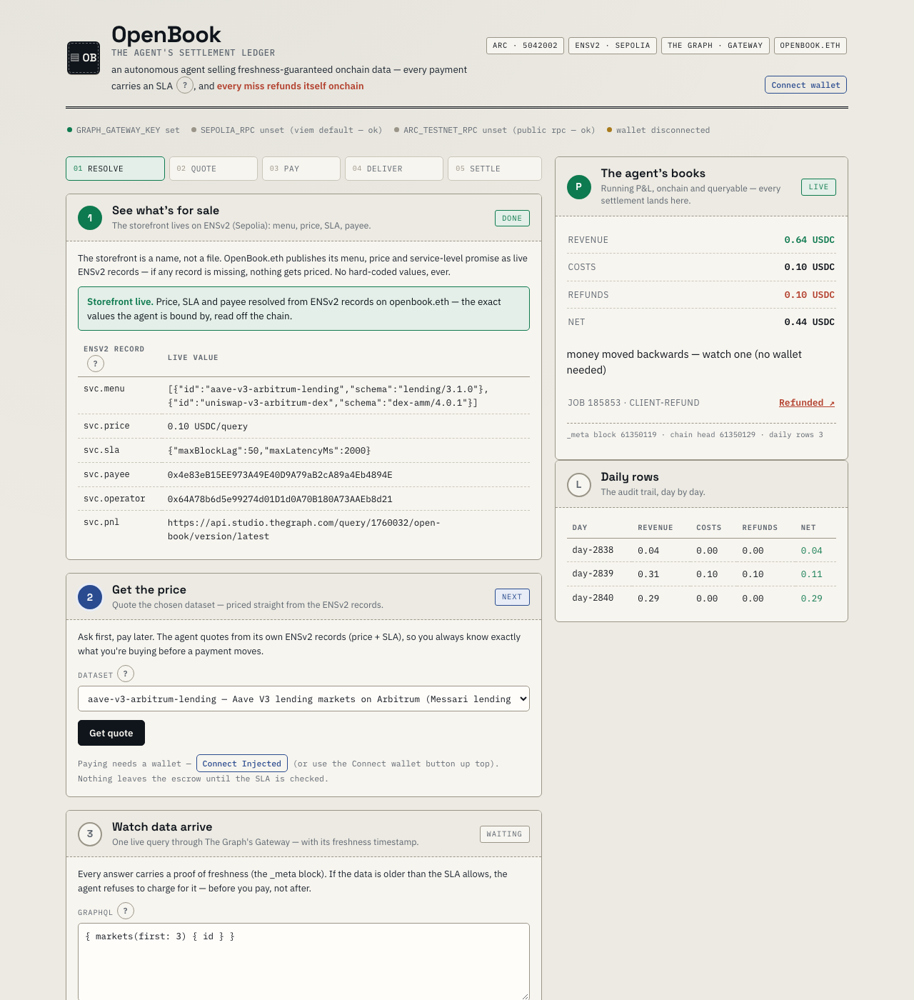

# OpenBook — Chargebacks for the Machine Economy

[](https://github.com/Aliserag/OpenBook/actions/workflows/ci.yml)

> An autonomous agent that sells freshness-guaranteed onchain data queries, pays its own
> costs, and publishes its P&L onchain. Built for ETHOnline 2026 (Sep 4–16).

**Bounties targeted (one project, three sponsors):**
- **Arc — Best Agentic Economy Application with Circle Agent Stack** ($3,500; +$2,500 if deployed to Arc Mainnet by Sep 30 — see [RUNBOOK.md](RUNBOOK.md))
- **The Graph — Best AI Tooling or AI Use Case with The Graph (Start Fresh)** ($5,000 pool)
- **ENS — Best Use of ENSv2** ($4,500)

## The pitch

Payment is the last mile of agent autonomy. Agents can hold keys and sign transactions, but
counterparties can't trust them: no service guarantees, no refunds, no recourse when the data
is stale. Everyone is building payment rails; nobody is building the control layer.

OpenBook's mechanic: **SLA-bound payments.** Every query carries verifiable conditions
committed at payment time — freshness block height, deliverable hash, deadline — through
Arc's ERC-8183 escrow standard. Settlement checks them deterministically. **Miss the SLA and
the refund executes onchain, automatically.** Money flows both ways.

**Watch the money move backwards (one click, no wallet):** a delivery pinned to a stale
`_meta` block got `REJECT (STALE_DATA)` and the escrow refunded the buyer on its own —
[Refunded tx 0x25e7805a…6063f on ArcScan](https://testnet.arcscan.app/tx/0x25e7805ae79fd8320ccbc74d90dead9d87b082fd299ecfe5a5949a968e16063f),
indexed in the agent's books ([live P&L panel](https://openbook.litai.ca) —
refunds column, no keys needed; [raw subgraph](https://api.studio.thegraph.com/query/1760032/open-book/version/latest)).



## Architecture


Rendered from the mermaid source in [docs/architecture.md](docs/architecture.md) (that file
carries the full flow, the deterministic demo path, and the trust model). The three sponsors
are organs, not stickers:

- **Arc (rail + cash register):** ERC-8004 agent identity, USDC nanopayments, ERC-8183
  escrow settlement, custom policy-gated treasury (`PolicyWallet.sol` with onchain
  `PolicyBlocked` events — Circle's built-in policies are mainnet-only; ours is the
  testnet-demoable path), and **onchain SLA adjudication** (`SlaHook.sol` — an
  EIP-8183 hook that blocks `complete()` unless the freshness proof covers the
  submitted deliverable and clears the floor; proven live: a stale completion
  reverts `SlaNotMet`, the refund path stays open). Wired through the shipped
  CLI: `--hook <addr>` + `OPENBOOK_ESCROW`/`OPENBOOK_HOOK` — a hooked job's
  settlement is enforced onchain, end to end, with the stock binary.
- **The Graph (the product):** `sla-subgraph-mcp` — a generic MCP server with a
  packaged, node-runnable bin (npm publishing is the one-line post-freeze step)
  that turns any subgraph into a paid, freshness-gated product; OpenBook is the reference
  deployment. Plus the `open-book` Studio subgraph on **arc-testnet** indexing every
  payment/refund/policy event — the agent's audited books.
- **ENS (storefront + business license):** `openbook.eth` on ENSv2 Sepolia publishes menu,
  pricing, SLA, and payee as text records; buyers hard-fail without resolution
  ("No ENS, no payment"). The `svc.payee` record names the PolicyWallet as the
  only payee — the storefront can never route money anywhere but the
  policy-gated treasury. The agent also runs its **own ENSv2 subname registry**
  (UserRegistry via the VerifiableFactory): each dataset is a subname —
  `aave-v3-arbitrum-lending.openbook.eth` prices itself, and the quote reads
  the most specific records through the hierarchical registry.

## Repo layout

- `contracts/` — PolicyWallet.sol (policy treasury) + SlaHook.sol (onchain SLA adjudication) + tests
- `agent/` — agent loop, ERC-8183 settlement spine, buyer CLI
- `mcp/` — `sla-subgraph-mcp` (the Graph tooling entry) + `SKILL.md`
- `subgraph/` — the P&L subgraph source (deployed to Studio as `open-book`, Arc testnet)
- `app/` — minimal Vite + wagmi frontend (storefront → pay → P&L)
- `scripts/` — ENS setup, spikes, stale-replay proxy
- `docs/` — architecture, design decisions, demo script, submission copy

## Quickstart

**Judge the live agent keyless in ~60 seconds** (quote + P&L need no keys — ENS
records and the Studio endpoint are public):

```bash
git clone https://github.com/Aliserag/OpenBook && cd OpenBook
bun install

# talk to the seller agent over stdio MCP — list the menu, read the live quote,
# read the agent's onchain books:
printf '%s\n' \
  '{"jsonrpc":"2.0","id":1,"method":"initialize","params":{"protocolVersion":"2024-11-05","capabilities":{},"clientInfo":{"name":"cli","version":"1.0"}}}' \
  '{"jsonrpc":"2.0","id":2,"method":"tools/call","params":{"name":"get_quote","arguments":{"datasetId":"aave-v3-arbitrum-lending"}}}' \
  '{"jsonrpc":"2.0","id":3,"method":"tools/call","params":{"name":"get_pnl","arguments":{}}}' \
  | bun mcp/src/server.ts --config mcp/config/openbook.json
```

Expected: the quote resolves `payee`/`price`/`sla` from the **live ENS records**
of `openbook.eth` (`"source": "ENS"`), and `get_pnl` returns the P&L rows the
`open-book` subgraph indexed from the escrow + policy contracts on Arc testnet.

```bash
bun test          # 71 unit tests, mock-injected, no keys needed
cd app && bun run dev   # storefront UI (quote + P&L work keyless;
                        # VITE_GRAPH_GATEWAY_KEY unlocks the live delivery step)
```

**Transact as an external buyer (~10 min, testnet money):**

```bash
cp .env.example .env   # add a free GRAPH_GATEWAY_KEY (thegraph.com/studio)
bash scripts/onboard-buyer.sh   # fresh key -> faucet wait -> one paid query
```

The script generates a buyer key, walks you through the free Arc faucet drip
([faucet.circle.com](https://faucet.circle.com) → pick **Arc Testnet** → paste
the address it prints), and runs the full loop: ENS quote → escrowed payment →
freshness-checked delivery → settle. With only your key the CLI signs both
sides (single-key mode, legal per ERC-8183 — the escrow/refund machinery is
fully exercised on the live contract). Missed SLA? The escrowed USDC is
claimable back after the job deadline — the auto-refund is the product.

Full tool reference + the one-command live-data path:
[mcp/README.md](mcp/README.md). Deploy/verify scripts: `scripts/`.

**Live deployment (all verifiable, all read-only):**

| piece | where |
| --- | --- |
| **Live demo (no keys needed)** | https://openbook.litai.ca — quote + P&L resolve keyless from live ENS records and the public subgraph |
| Frontend hosting | Cloudflare Pages project `openbook` (custom domain `openbook.litai.ca`); redeploy with `cd app && bun run build && npx wrangler pages deploy dist --project-name openbook` |
| Storefront | `openbook.eth` on ENSv2 Sepolia (10 records: menu/price/SLA/payee/…/agent-registration; `agent-endpoint[web]` = the live demo URL) |
| Escrow rail | ERC-8183 `0x0747EEf0706327138c69792bF28Cd525089e4583` on Arc testnet (chain 5042002) |
| Policy treasury | `PolicyWallet` `0x4e83eB15EE973A49E40D9A79aB2cA89a4Eb4894E` (Arc testnet) |
| Agent identity | ERC-8004 **agentId 894065** on Arc testnet |
| Audited books | `open-book` subgraph — `https://api.studio.thegraph.com/query/1760032/open-book/version/latest` (public) |

## What's proven, and what isn't

Every claim in this README was checked by reading it back from the chain, the gateway, or a
fresh clone — not inferred from the code.

| Proven | How you can check it |
| --- | --- |
| The judge path works with **no keys** | fresh clone → the stdio command above returns a quote (`"source": "ENS"`) and the indexed P&L in under a second |
| A stale delivery **refunded the buyer onchain, automatically** | the [Refunded tx](https://testnet.arcscan.app/tx/0x25e7805ae79fd8320ccbc74d90dead9d87b082fd299ecfe5a5949a968e16063f) and the `refunds` row in the live P&L |
| Treasury policy is enforced **onchain** | `PolicyWallet` verified on ArcScan; `PolicyBlocked` rows indexed by the subgraph |
| Contracts and tests are real | 20 forge tests · 71 unit tests · 3-job CI (badge above) |

**Not proven — stated plainly:**

- **No third party has paid yet.** Every transaction so far is our own wallets.
  `scripts/onboard-buyer.sh` makes it one command for anyone (~10 min, testnet USDC).
- **The seller is a deterministic watch loop**, not an LLM reasoning agent. The autonomy
  claimed here is over *settlement*, not inference.
- **The latency bound is buyer-attested** (reputation-layer only); the freshness *block*
  bound is the one the onchain `SlaHook` enforces.
- The escrow and identity contracts are Circle's ERC-8183 / ERC-8004 **reference
  deployments**; the custom work is `PolicyWallet.sol`, `SlaHook.sol`, the MCP seller, and
  the ENSv2 storefront.

## Status

Submission-ready build for ETHOnline 2026 (Sep 4–16); deployed pieces live on Arc testnet and Sepolia (see [RUNBOOK.md](RUNBOOK.md)).
