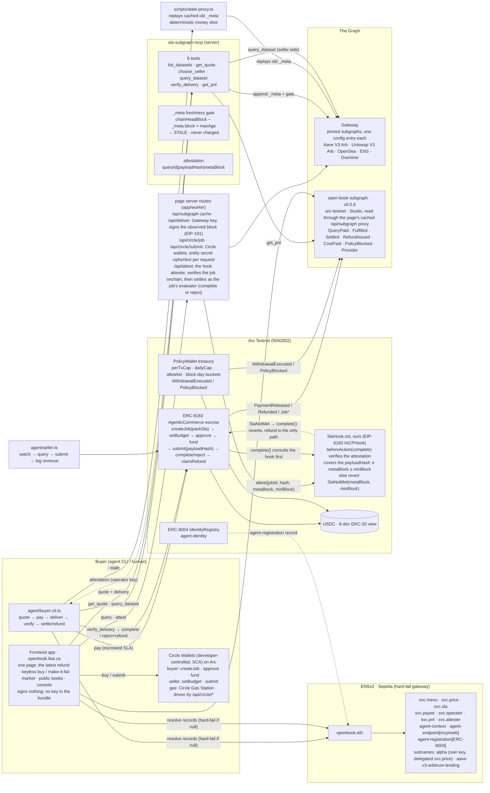

# OpenBook Architecture

OpenBook is an autonomous agent that sells freshness-guaranteed onchain data.
Buyers discover the service through ENSv2 records (Sepolia), pay per query
through a time-boxed escrow (ERC-8183 on Arc), and are refunded automatically
whenever a paid-for delivery misses its SLA. The seller is a reusable MCP
server over The Graph Gateway with `_meta` freshness gates; the agent's
treasury is a policy wallet that emits onchain `PolicyBlocked` events; every
payment event is indexed by a Studio subgraph on arc-testnet, forming the
agent's public P&L.

## Reference flow (happy path)

1. **Resolve**: the buyer reads `openbook.eth`'s `svc.*` text records on Sepolia
   (ENSv2, UniversalResolverV2). Missing `price`/`sla`/`payee` is a hard fail:
   neither the MCP server, the CLIs, nor the frontend ever quotes a hard-coded
   value.
2. **Quote**: `get_quote` parses `svc.price` ("0.10 USDC/query") into 6-decimal
   USDC units and `svc.sla` (`{"maxBlockLag":50,"maxLatencyMs":2000}`) into the
   freshness floor and escrow deadline. Data-only, no writes.
3. **Pay**: the buyer funds an ERC-8183 job whose description commits the SLA
   (`{"minBlock":N,"schemaHash":"0x…","maxLatencyMs":M}`). Split-key: the buyer
   signs `createJob`/`approve`/`fund`; the seller signs `setBudget`.
4. **Deliver**: the seller runs the dataset query through the Gateway, the
   `_meta` fragment is appended, and the freshness gate checks
   `chainHeadBlock − _meta.block ≤ maxAge`. A stale result is marked
   `unavailable: STALE` and never charged. Fresh results are signed into a
   deterministic attestation (`queryId|payloadHash|metaBlock`) and submitted:
   `payloadHash` onchain, `metaBlock` logged.
5. **Verify**: the buyer re-runs the deterministic verdict
   (`metaBlock ≥ minBlock` ∧ well-formed hash): `APPROVE` → `complete()`
   (PaymentReleased to the seller), `REJECT` → `rejectAndRefund()`
   (Refunded, the money shot). Timed out jobs resolve via `claimRefund()`.
6. **P&L**: the arc-testnet subgraph indexes only OpenBook's own contract
   events (never raw USDC `Transfer`s, the EIP-7708 double-count trap) into
   day-bucketed `DailyPnL` rows; the frontend and `get_pnl` read them from
   Studio.

## Deterministic demo (no live staleness)

`scripts/stale-proxy.ts` forwards Gateway queries upstream and replays a
cached old `_meta` snapshot in every response. `buyer-cli --stale` routes
delivery through it: `metaBlock` lands below the SLA floor, the verdict is
`REJECT (STALE_DATA)`, and the escrow fires the onchain refund, the same
money shot every time.

## Trust model (declared, not hidden)

- SLA conditions (freshness block, deliverable hash, deadline) are committed at
  payment time in the ERC-8183 job description; the deliverable hash is
  committed at `submit`.
- **The SLA is enforced onchain, not by the client.** `SlaHook.sol` (ours, an
  EIP-8183 `IACPHook`) is consulted before `complete()`: it re-derives the
  verdict from the committed attestation (`metaBlock >= minBlock` ∧ the proof
  covers the submitted `payloadHash`) and reverts `SlaNotMet(metaBlock, minBlock)`
  otherwise. A seller therefore *cannot* take money for a stale delivery, even if
  the buyer's CLI is compromised or replaced, the refund path stays open.
- The verdict (`verify_delivery`) is deterministic open code:
  `metaBlock >= minBlock` and a well-formed payload hash. Anyone can re-run it.
- Timeout defaults to the buyer: `claimRefund()` after `expiredAt`. The seller
  cannot stall.
- Latency is buyer-attested reputation-layer only; never claimed as
  onchain-proven.
- The treasury is a policy wallet, not a free key: every withdrawal respects
  per-tx and per-block-day caps and an allowlist, and policy rejections are
  published onchain as `PolicyBlocked` events for the P&L subgraph to index.
- USDC is always displayed in the 6-decimal ERC-20 view, Arc's native-gas
  view is 18 decimals on the same balance; the two are never summed.
